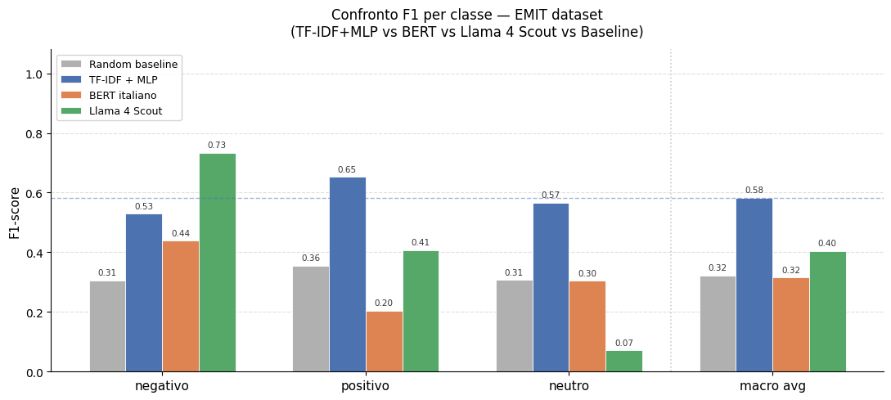

# MLPvsBERTvsLLM_Sentiment_Analysis_ita
A comparison among a simple pipeline TF-IDF + MLP, a BERT model and LLama 4 Scout on a simple Positive/Negative/Neutral classification task on Emit dataset (Social Media)
> Labels: `negativo` · `positivo` · `neutro`

## Models compared

| Model | Type | Training |
|-------|------|----------|
| TF-IDF + MLP | Supervised | EMit train set |
| `neuraly/bert-base-italian-cased-sentiment` | Zero-shot | External corpus |
| `meta-llama/llama-4-scout-17b-16e-instruct` (Groq) | Zero-shot | — |

## Dataset

**EMit** — Italian social media messages (TV shows, music, ads),
annotated with Plutchik's 8 primary emotions + "love".  
Emotion labels are remapped to a 3-class sentiment scheme for this task.

→ [`MattiaSangermano/emit`](https://huggingface.co/datasets/MattiaSangermano/emit)
on HuggingFace

## Results



## Setup

```bash
pip install -r requirements.txt
```

Set your Groq API key as an environment variable before running
the Llama section:

```bash
export GROQ_API_KEY="your-key-here"
```

Then open `Sentiment_Analysis_SocialMedia.ipynb` in Jupyter
and run cells sequentially.

> **Note:** the BERT section requires a GPU (or Colab).
> The TF-IDF + MLP pipeline runs on CPU.

## Key findings

- TF-IDF + MLP is the fastest and most data-safe option for production;
  needs improvement on negative emotion recall.
- BERT and Llama 4 Scout perform zero-shot without any task-specific training.
- A bonus cell delegates the final report summary to GPT-oss via Groq,
  framed as a business-facing analyst report.

## Tech stack

- **Dataset**: HuggingFace `datasets`
- **Classical ML**: scikit-learn (TF-IDF, MLP, metrics)
- **Transformer**: HuggingFace `transformers`
- **LLM inference**: Groq API (Llama 4 Scout, GPT-oss-20b)
